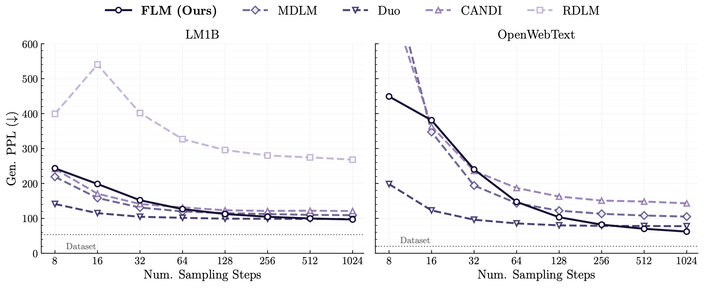
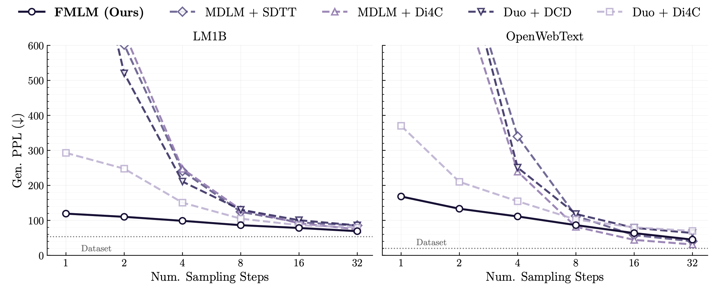

<h1 align="center">Flow Map Language Models:<br>One-step Language Modeling via Continuous Denoising</h1>

<div align="center">
  
**[Chanhyuk Lee](https://david3684.github.io)**<sup>1</sup>, **[Jaehoon Yoo](https://sites.google.com/view/jaehoon-yoo/홈)**<sup>1</sup>, **[Manan Agarwal](https://mananag007.github.io)**<sup>2</sup>, **[Sheel Shah](https://sheelfshah.github.io)**<sup>2</sup>, **[Jerry Huang](https://jrrhuang.github.io/)**<sup>2</sup>, \
**[Aditi Raghunathan](https://www.cs.cmu.edu/~aditirag/)**<sup>2</sup>, **[Seunghoon Hong](https://maga33.github.io/)**<sup>1</sup>, **[Nicholas M. Boffi](https://nmboffi.github.io/)**<sup>†2</sup>, **[Jinwoo Kim](https://jw9730.github.io/)**<sup>†1</sup>


<sup>1</sup>KAIST &nbsp; <sup>2</sup>Carnegie Mellon University &nbsp; <sup>†</sup>Equal advising
</div>

<div align="center">

[](https://arxiv.org/abs/2602.16813)
[](https://one-step-lm.github.io/)
[](https://one-step-lm.github.io/blog/index.html)
[](https://drive.google.com/drive/folders/1fNAx4LP2RwPBdqDQFQ_gRrYZI9u3Vq15?usp=drive_link)
[](https://huggingface.co/collections/david3684/flm-fmlm)

</div>

## News

- **[2026-05]** Added huggingface links for the checkpoints. 
- **[2026-04]** We released LM1B/OpenWebText checkpoints for FLM and FMLM. 

## TL;DR

<p align="center">
  
</p>

<p align="center">
  
</p>

We introduce **Flow Language Model (FLM)** and its flow-map distilled variant **Flow Map Language Model (FMLM)**, enabling **one-step parallel text generation** through continuous denoising. 

## Overview

**FLM** applies the benefits of continuous image generation to discrete state spaces by encoding text as one-hot vectors and using flow matching to directly map noise to one-hot data. Unlike discrete diffusion, **FLM** gradually denoises all tokens in parallel with a deterministic sample-level ODE, allowing it to represent a superposition of sequences and avoid per-token ancestral sampling — a fundamental bottleneck for discrete diffusion in the few-step regime. We extend this to FMLM, where learns the **flow map** which is the direct solution operator of the flow, enabling a **single-NFE parallel language generation**.

## How to Run

### Install Dependencies

```bash
pip install torch>=2.3.0
pip install -r requirements.txt
# Install flash-attn separately matching your python / torch version (see https://github.com/Dao-AILab/flash-attention/releases)
pip install flash-attn==2.8.3 --no-build-isolation
```

Our DiT backbone supports `torch.compile` with `max-autotune` for faster training. Enable it by setting the environment variable before running any script:

```bash
export DIT_USE_COMPILE=TRUE
```

With the option, we are able to train OpenWebText experiments with 512 batch size on 8 H100 (80GB VRAM), with local batch size of 32.

### Training

Before running, update `data.cache_dir` in the scripts to point to your dataset location. If the directory is empty, the dataset will be automatically downloaded and preprocessed.

Set `algo.teacher_path` to your pre-trained FLM checkpoint before running FMLM distillation.


| Model | Dataset     | Script                                                                     |
| ----- | ----------- | -------------------------------------------------------------------------- |
| FLM   | LM1B        | [scripts/train_lm1b_flm.sh](scripts/train_lm1b_flm.sh)                     |
| FMLM  | LM1B        | [scripts/train_lm1b_fmlm_denoiser.sh](scripts/train_lm1b_fmlm_denoiser.sh) |
| FLM   | OpenWebText | [scripts/train_owt_flm.sh](scripts/train_owt_flm.sh)                       |
| FMLM  | OpenWebText | [scripts/train_owt_fmlm_denoiser.sh](scripts/train_owt_fmlm_denoiser.sh)   |

### Evaluation

Set `CKPT_PATH` in the script to your trained checkpoint before running.


| Model | Dataset     | Script                                                       |
| ----- | ----------- | ------------------------------------------------------------ |
| FLM   | LM1B        | [scripts/gen_ppl_lm1b_flm.sh](scripts/gen_ppl_lm1b_flm.sh)   |
| FMLM  | LM1B        | [scripts/gen_ppl_lm1b_fmlm.sh](scripts/gen_ppl_lm1b_fmlm.sh) |
| FLM   | OpenWebText | [scripts/gen_ppl_owt_flm.sh](scripts/gen_ppl_owt_flm.sh)     |
| FMLM  | OpenWebText | [scripts/gen_ppl_owt_fmlm.sh](scripts/gen_ppl_owt_fmlm.sh)   |

## Checkpoints
### Pretrained Checkpoints

Pretrained FLM and FMLM checkpoints are available at [Google Drive](https://drive.google.com/drive/folders/1fNAx4LP2RwPBdqDQFQ_gRrYZI9u3Vq15?usp=drive_link) or [Huggingface](https://huggingface.co/collections/david3684/flm-fmlm).


| Model | Dataset     | Checkpoint       |
| ----- | ----------- | ---------------- |
| FLM   | LM1B        | `lm1b_flm.ckpt`  |
| FMLM  | LM1B        | `lm1b_fmlm.ckpt` |
| FLM   | OpenWebText | `owt_flm.ckpt`   |
| FMLM  | OpenWebText | `owt_fmlm.ckpt`  |


Set `eval.checkpoint_path` (or `algo.teacher_path` for distillation) to the downloaded checkpoint path when running evaluation or distillation scripts.

### Baseline Checkpoints

Reproduced baseline checkpoints for LM1B are available at [here](https://drive.google.com/drive/folders/1TJO3aFWqI7ukbmjciZ6krAUFlAak1itl?usp=drive_link).

For other checkpoints, mostly for OpenWebText, refer to [Duo](https://github.com/s-sahoo/duo), [SDTT](https://github.com/jdeschena/sdtt), [RDLM](https://github.com/harryjo97/RDLM), [di4c](https://github.com/sony/di4c) repositories.


### Full results 

#### FLM 
<p align="center">
  
</p>

#### LM1B - FLM (Undistilled)
| Step | Gen.PPL | Entropy |
| :---: | :---: | :---: |
| **8** | 243.36 | 2.41 |
| **16** | 198.53 | 4.22 |
| **32** | 152.01 | 4.40 |
| **64** | 126.51 | 4.36 |
| **128** | 112.54 | 4.34 |
| **256** | 104.59 | 4.32 |
| **512** | 99.75 | 4.30 |
| **1024** | 96.91 | 4.29 |

#### OpenWebText - FLM (Undistilled)
| Step | Gen.PPL | Entropy |
| :---: | :---: | :---: |
| **8** | 449.15 | 5.21 |
| **16** | 380.99 | 5.66 |
| **32** | 240.11 | 5.72 |
| **64** | 147.28 | 5.68 |
| **128** | 103.30 | 5.58 |
| **256** | 82.05 | 5.48 |
| **512** | 70.22 | 5.40 |
| **1024** | 62.23 | 5.33 |

#### FMLM

<p align="center">
  
</p>

#### LM1B - FMLM (Distilled)
| Step | Gen.PPL | Entropy |
| :---: | :---: | :---: |
| **1** | 119.34 | 4.16 |
| **2** | 110.19 | 4.21 |
| **4** | 98.76 | 4.21 |
| **8** | 86.32 | 4.21 |
| **16** | 78.35 | 4.21 |
| **32** | 69.21 | 4.21 |

#### OpenWebText - FMLM (Distilled)
| Step | Gen.PPL | Entropy |
| :---: | :---: | :---: |
| **1** | 168.30 | 5.17 |
| **2** | 133.29 | 5.25 |
| **4** | 111.31 | 5.26 |
| **8** | 86.50 | 5.36 |
| **16** | 63.63 | 5.29 |
| **32** | 45.09 | 5.25 |

## BibTeX

```bibtex
@article{lee2026flow,
    title={Flow Map Language Models: One-step Language Modeling via Continuous Denoising},
    author={Chanhyuk Lee and Jaehoon Yoo and Manan Agarwal
            and Sheel Shah and Jerry Huang
            and Aditi Raghunathan and Seunghoon Hong
            and Nicholas M. Boffi and Jinwoo Kim},
    journal={arXiv preprint arXiv:2602.16813},
    year={2026},
}
```

---

## Acknowledgements

This repository is built upon the codebases of **[Duo](https://github.com/s-sahoo/duo)** and **[ReDi](https://github.com/Ugness/ReDi)**.